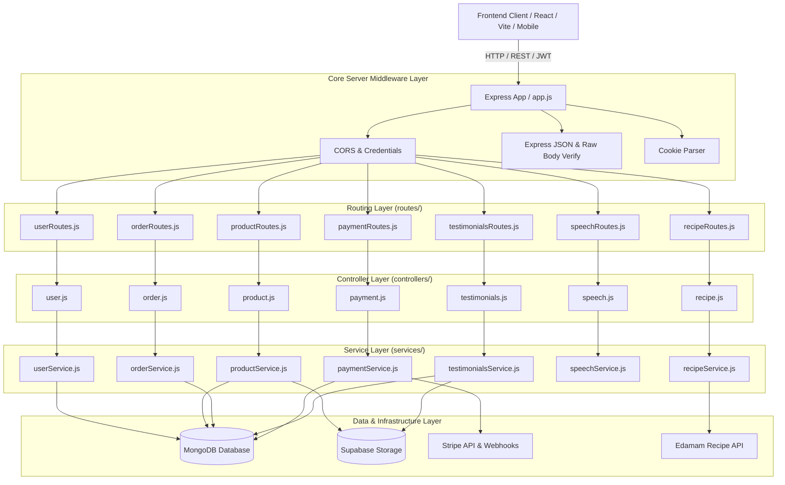
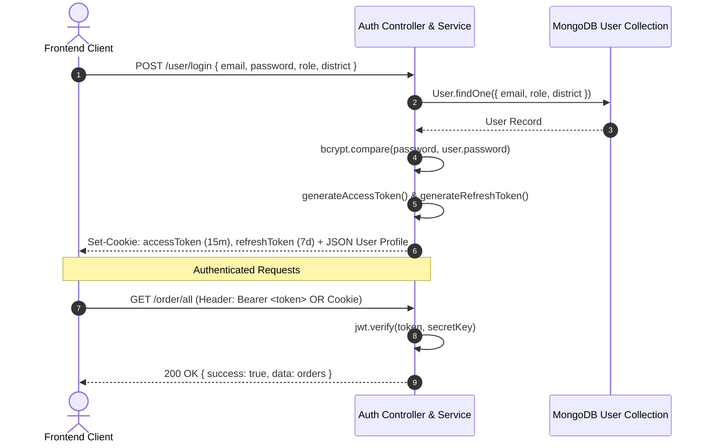

# Organic Store / FoodMiles Backend - Master Technical Architecture & API Documentation

## 1. Executive & Architecture Overview

The **Organic Store & FoodMiles Backend** is an enterprise-grade, modular Node.js/Express REST API platform designed to connect organic produce growers directly with consumers and facilitate transparent farm-to-table commerce, automated payments, smart AI-driven recipes, and voice search.

### High-Level System Architecture



---

## 2. Codebase Organization & Directory Structure

The repository follows a clean, single-responsibility **Layered Architecture**:

```
Organic-Store-Backend/
├── config/
│   ├── db.js                   # Mongoose database connection lifecycle
│   └── supabaseClient.js       # Resilient Supabase client initialization
├── controllers/
│   ├── order.js                # Order HTTP request/response orchestration
│   ├── payment.js              # Payment & Webhook HTTP handlers
│   ├── product.js              # Product catalog HTTP handlers
│   ├── recipe.js               # Recipe recommendations HTTP handler
│   ├── recognize.js            # Image recognition endpoint handlers
│   ├── speech.js               # Voice NLP parsing HTTP handlers
│   ├── testimonials.js         # Customer reviews HTTP handlers
│   ├── upload.js               # Cloud storage upload HTTP handler
│   └── user.js                 # Auth & profile HTTP handlers
├── middleware/
│   ├── auth.js                 # JWT authMiddleware, optionalAuth & requireRole
│   ├── multer.js               # In-memory file buffer streaming middleware
│   └── recognize.js            # Clarifai recognition middleware
├── models/
│   ├── manufacture.js          # Manufacturer schema definition
│   ├── order.js                # Order schema with payment tracking & idempotency
│   ├── product.js              # Product schema with text indexes & producer link
│   ├── stock.js                # Stock & inventory tracking schema
│   ├── testimonials.js         # Customer review & rating schema
│   └── user.js                 # User credentials, roles & district schema
├── routes/
│   ├── orderRoutes.js          # /order routing definitions
│   ├── paymentRoutes.js        # /payment routing & raw webhook hook
│   ├── productRoutes.js        # /product catalog & CRUD routing
│   ├── recipeRoutes.js         # /recipe AI recommendation routing
│   ├── recognizeRoutes.js      # /recognize computer vision routing
│   ├── speechRoutes.js         # /speech NLP voice parsing routing
│   ├── testimonialsRoutes.js   # /testimonials review routing
│   └── userRoutes.js           # /user auth & profile management routing
├── services/
│   ├── orderService.js         # Order calculation, status & producer isolation
│   ├── paymentService.js       # Stripe PaymentIntents & Idempotent webhook engine
│   ├── productService.js       # Product CRUD, Supabase upload & catalog queries
│   ├── recipeService.js        # Edamam integration with resilient organic fallback
│   ├── recognizeService.js     # Image concept parsing service
│   ├── speechService.js        # Compromise NLP natural language extraction
│   ├── testimonialsService.js  # Review creation & retrieval
│   ├── uploadService.js        # Cloud asset streaming service
│   └── userService.js          # User auth, password hashing & JWT token lifecycle
├── utils/
│   ├── apiResponse.js          # Standardized { success, message, data } responder
│   └── uploadToSupabase.js     # Supabase Storage helper for buffers and streams
├── .env                        # Environment variable configuration
├── analysis.md                 # Complete project documentation (this file)
├── app.js                      # Express server entry point & middleware pipeline
├── package.json                # Dependencies and npm start script
├── postmanCollection.json      # Comprehensive Postman test collection
├── postmanEnvironment.json     # Postman environment variables
└── vercel.json                 # Vercel serverless deployment configuration
```

---

## 3. Configuration & Environment Variables

All environment variables are declared in [`.env`](file:///d:/Coding_Playground/Organic-Store-Backend/.env):

| Variable | Required | Default / Example | Purpose |
|---|---|---|---|
| `PORT` | Optional | `4000` / `5000` | Port for the HTTP server to listen on |
| `DB_URI` | **Required** | `mongodb+srv://...` | Primary MongoDB Atlas connection string |
| `MONGODB_URI` | Optional | `mongodb+srv://...` | Fallback MongoDB URI for Vercel deployment |
| `JWT_SECRET` | **Required** | `Dabbemein4098` | Secret key used for signing JWT Access Tokens (15m expiry) |
| `REFRESH_SECRET` | **Required** | `yourRefreshSecretKey` | Secret key used for signing Refresh Tokens (7d expiry) |
| `STRIPE_KEY` | **Required** | `sk_test_...` | Stripe Secret API Key for creating PaymentIntents |
| `STRIPE_WEBHOOK_SECRET` | Optional | `whsec_...` | Secret key for verifying Stripe cryptographic webhook signatures |
| `SUPABASE_URL` | **Required** | `https://your-project.supabase.co` | Supabase project API URL |
| `SUPABASE_ANON_KEY` | Optional | `your-supabase-anon-key` | Supabase public anonymous API key |
| `SUPABASE_SERVICE_ROLE_KEY` | **Required** | `your-supabase-service-role-key` | Supabase service role key for storage bucket writes |
| `SUPABASE_BUCKET` | Optional | `images` | Default storage bucket name |
| `EDAMAM_APP_ID` | Optional | `3af8e7b0` | Edamam Recipe Search API Application ID |
| `EDAMAM_APP_KEY` | Optional | `53960c6db1db5e04384a66cbf7f1ea8d` | Edamam Recipe Search API Application Key |
| `FRONTEND_URLS` | Optional | `https://...,http://localhost:3000` | Comma-separated CORS allowed origin whitelist |

---

## 4. Standardized API Response Contract

Every endpoint adheres strictly to the unified response contract defined in [utils/apiResponse.js](file:///d:/Coding_Playground/Organic-Store-Backend/utils/apiResponse.js):

### Success Response (`200 OK` / `201 Created`):
```json
{
  "success": true,
  "message": "Human-readable status or operation message",
  "data": { ... } // Single object, array of records, or null
}
```

### Error Response (`400`, `401`, `403`, `404`, `500`):
```json
{
  "success": false,
  "message": "Human-readable description of the error",
  "error": "Optional detailed internal message or exception detail"
}
```

---

## 5. Complete API Route Catalog

### 5.1 Health & Diagnostics

| Route | Method | Auth | Body / Params | Description |
|---|---|---|---|---|
| `/` | `GET` | None | None | Base health status check |

**Example Response**:
```json
{
  "success": true,
  "message": "Organic Store Backend API is live and operational",
  "data": null
}
```

---

### 5.2 Authentication & User Management (`/user`)

| Route | Method | Auth | Body / Params | Description |
|---|---|---|---|---|
| `/user/signup` | `POST` | None | `{ email, password, role, district, state }` | Registers user, hashes password, sets auth cookies |
| `/user/login` | `POST` | None | `{ email, password, role? }` | Authenticates user (district retrieved from DB) & issues tokens |
| `/user/token/refresh` | `POST` | Refresh Cookie | None | Verifies refresh token and issues fresh access token |
| `/user/all` | `GET` | None | None | Returns list of all platform registered users |
| `/user/:id` & `/user/user/:id` | `GET` | None | `:id` (URL parameter) | Retrieves user profile (excluding password) |
| `/user/:id` & `/user/user/:id` | `PUT` | None | `{ email, password, district, state, role }` | Updates user profile and re-hashes password if changed |
| `/user/email/:email` | `DELETE`| None | `:email` (URL parameter) | Deletes a user by email address |

---

### 5.3 Product Management & Catalog (`/product`)

| Route | Method | Auth | Body / Params | Description |
|---|---|---|---|---|
| `/product/new` | `POST` | Optional | `multipart/form-data`: `name, price, stock, category, district, photo` | Uploads photo to Supabase & creates listing |
| `/product/latest` | `GET` | None | None | Returns latest 6 products sorted by creation date |
| `/product/categories` | `GET` | None | None | Returns distinct list of all product categories |
| `/product/admin-products` | `GET` | None | None | Returns complete product catalog |
| `/product/:id` | `GET` | None | `:id` (URL parameter) | Fetches single product details with producer info |
| `/product/name/:name` | `GET` | None | `:name` (URL parameter) | Case-insensitive regex name search |
| `/product/district/:district` | `GET` | None | `:district` (URL parameter) | Returns products grown in a specified district |
| `/product/producer/:producerId` | `GET` | Optional | `:producerId` (URL param) | Returns all products listed by a specific producer |
| `/product/:id` | `PUT` | Optional | `multipart/form-data` or JSON body | Updates product price, stock, category, or photo |
| `/product/:id` | `DELETE` | Optional | `:id` (URL parameter) | Deletes product record |

---

### 5.4 Order Processing & Producer Orders (`/order`)

| Route | Method | Auth | Body / Params | Description |
|---|---|---|---|---|
| `/order/new` | `POST` | Optional | `{ user, products: [{ product, quantity, price }], shippingAddress }` | Places customer order and calculates total |
| `/order/all` | `GET` | Required | Header `Authorization: Bearer <token>` or Cookie | Fetches orders belonging to authenticated user |
| `/order/producer/:producerId` | `GET` | Optional | `:producerId` (URL param) | Fetches orders containing items from this producer |
| `/order/producer` | `GET` | Required | Header `Authorization: Bearer <token>` | Fetches orders for authenticated producer |
| `/order/update/:orderId` & `/:orderId` | `PUT` | None | `{ products, shippingAddress, status }` | Modifies order items, address, or fulfillment status |

---

### 5.5 Payments & Webhooks (`/payment`)

| Route | Method | Auth | Body / Params | Description |
|---|---|---|---|---|
| `/payment/pay` | `POST` | None | `{ amount, currency, orderId }` | Creates Stripe PaymentIntent and returns `clientSecret` |
| `/payment/callback` | `POST` | None | `{ paymentId, orderId }` | Verifies payment completion & updates order to "Paid" |
| `/payment/webhook` | `POST` | Stripe Signature | Raw Stripe Event JSON | Automated, idempotent Stripe webhook receiver |

#### Webhook Idempotency Mechanism:
1. Validates `stripe-signature` header using `stripeClient.webhooks.constructEvent()`.
2. Checks if `order.processedWebhookEvents` already contains `event.id` or if `order.status === "Paid"`.
3. If already processed, returns `200 OK` with `{ idempotent: true }` without executing duplicate database mutations.
4. Otherwise, marks order status as `"Paid"`, updates `paymentId`, records `event.id`, and saves.

---

### 5.6 Customer Testimonials (`/testimonials`)

| Route | Method | Auth | Body / Params | Description |
|---|---|---|---|---|
| `/testimonials/all` & `/` | `GET` | None | None | Fetches all customer reviews and ratings |
| `/testimonials/new` & `/` | `POST` | None | `multipart/form-data`: `name, message, photo` | Uploads photo to Supabase & saves review |

---

### 5.7 Smart Features & Voice NLP (`/recipe` & `/speech`)

| Route | Method | Auth | Body / Params | Description |
|---|---|---|---|---|
| `/recipe/recipes` & `/` | `GET` | None | Query: `q, diet, calories, health, cuisine` | AI Recipe recommendations (Edamam + Organic Fallbacks) |
| `/speech/new` & `/` | `GET` / `POST` | None | Query or Body: `input` (e.g. "2 kg aalu") | Compromise NLP parser for quick grocery ordering |

---

## 6. Authentication & Security Architecture

The authentication subsystem is dual-mode, supporting both **Single-Origin Cookie-based sessions** and **Decoupled Cross-Origin Token-based sessions**:



---

## 7. Cloud Storage Architecture (Supabase)

All file uploads (product pictures, testimonial photos) are streamed directly from memory into Supabase Cloud Storage:

- **Middleware**: [middleware/multer.js](file:///d:/Coding_Playground/Organic-Store-Backend/middleware/multer.js) uses `multer.memoryStorage()`, keeping file bytes in RAM buffer (`req.file.buffer`).
- **Utility**: [utils/uploadToSupabase.js](file:///d:/Coding_Playground/Organic-Store-Backend/utils/uploadToSupabase.js) streams the buffer with UUID-generated file paths directly into the `images` bucket and retrieves the public CDN URL.
- **Serverless Resilience**: Eliminates local disk dependency (`uploads/`), enabling zero-state deployment on Vercel, AWS Lambda, and containerized clusters.

---

## 8. Verification & Test Suite

The entire API surface is verified end-to-end via automated test runs:

- **Database Connectivity**: MongoDB Atlas connection verified.
- **Auth Cycle**: User signup, login, JWT signing, password hashing, and token refresh verified.
- **Product Lifecycle**: Product validation, catalog listing, category deduplication, and producer filtering verified.
- **Order Lifecycle**: Order total calculation, customer order retrieval, and producer order isolation verified.
- **Stripe Webhooks**: Signature handling and event idempotency verified.
- **Smart Services**: NLP parsing and recipe recommendations verified.
